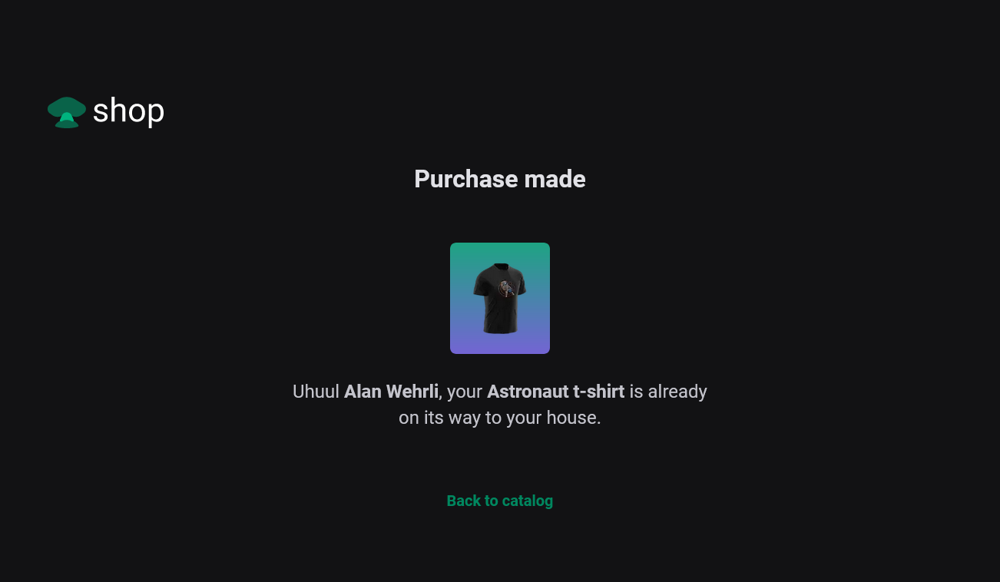

<h1 align="center">Shop</h1>
<p align="center">Simple shirt sales website example!</p>

<h3 align="center">

  <a href="./LICENSE" target="_blank">
    
  </a>

</h3>

<br />

<p align="center">
    
    
</p>
<p align="center">
    
    
</p>

<br />

# Techs

-  Next
-  Axios
-  React
-  Stripe
-  Stitches
-  Typescript
-  Keen Slider
-  Styled Components


## Installation of dependencies and local use

>> Don't forget to create some environment variables in the `.env.local` file, containing the api route of the "localhost" site, the [stripe](https://stripe.com/) public key and the private key! Like the ones below: 

>> ### [Documentation Stripe](https://stripe.com/docs)

```.env
#APP
NEXT_URL=http://localhost:3000/

#stripe
STRIPE_PUBLIC_KEY=
STRIPE_SECRETE_KEY=
```
> Create somewhere on your pc, a folder to create a copy of the repository, inside it open command terminal and type the commands below:


```
git clone https://github.com/AlanWehrliLC/shop.git
cd shop
npm install
npm run dev
```